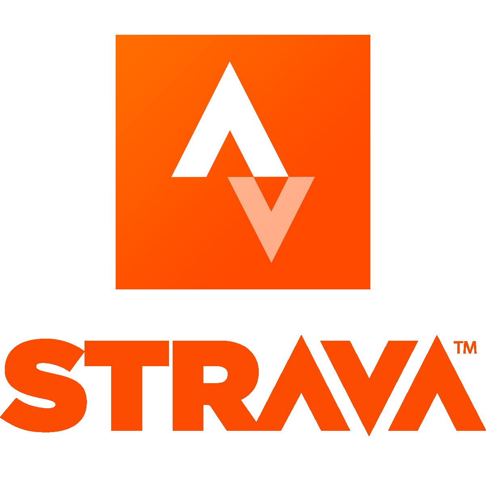
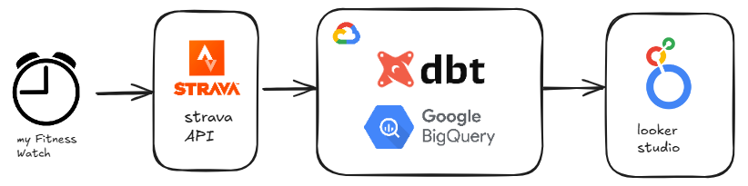
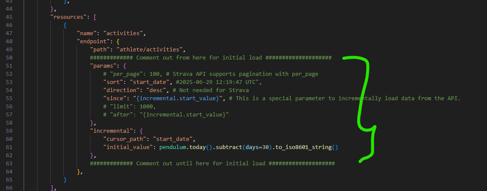

<h2>My Strava Stats Dashboard</h2>
Tech Stack used in this Project
<div style="text-align: center;">
  <table>
    <tr>
      <td align="center"></td>
      <td align="center"></td>
      <td align="center"></td>
      <td align="center"></td>
      <td align="center"></td>
    </tr>
  </table>
</div>

<a href="https://lookerstudio.google.com/reporting/f472dda8-c0e5-45c6-a52f-95eee12d3e1a">My Strava Stats Dashboard Link</a>

### High Level Conceptual Data Flow Diagram:



### Initial Setup steps

```
uv init
uv add dlt[bigquery]
dlt init rest_api bigquery
uv run dlt_strava_bigquery_extn.py

``` 

### Day today 

Run ~strava_authorize.py to refresh access code for strava api
Access Code, Client ID, Secret etc shared here ~ .dlt/secrets.toml
Pylint will only run when commit message has this string "CheckCodeQuality"

### Looker Studio Portal

<a href="https://lookerstudio.google.com/u/0/navigation/reporting">Looker Studio Editor Link</a>

### for initial load 


